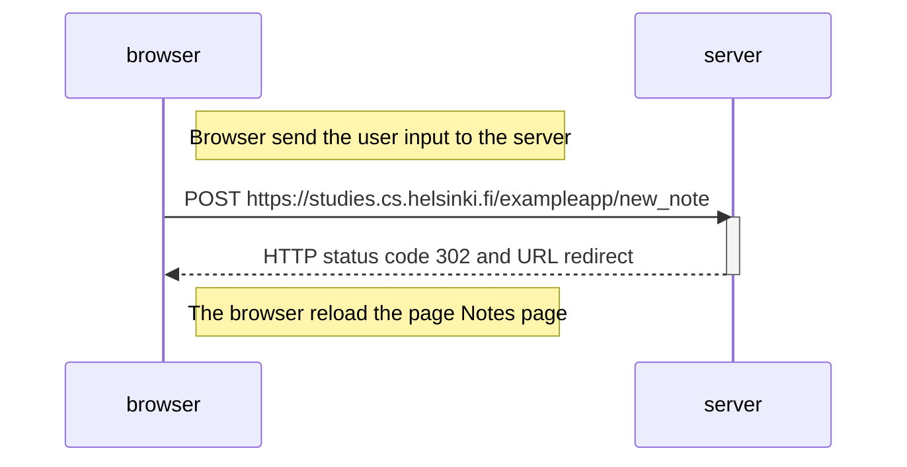
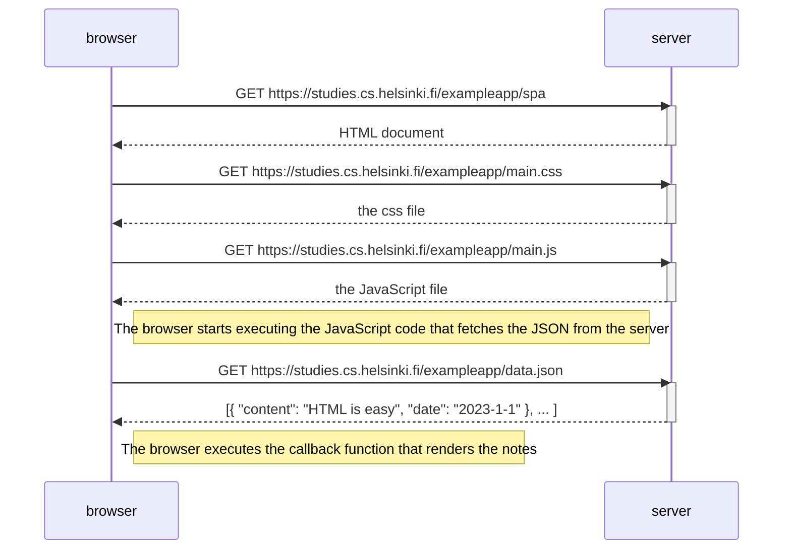
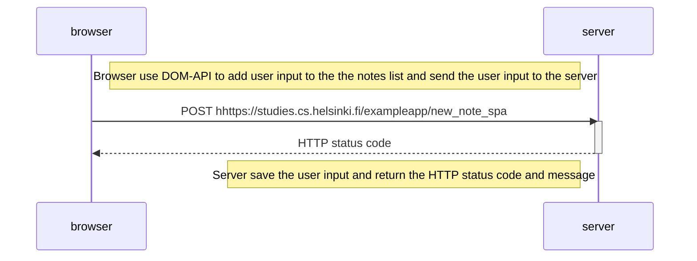

# Part 0

## 0.4: New note diagram

```mermaid
sequenceDiagram
    participant browser
    participant server

    Note right of browser: Browser send the user input to the server
    browser->>server: POST https://studies.cs.helsinki.fi/exampleapp/new_note
    activate server
    server-->>browser: HTTP status code 302 and URL redirect
    deactivate server
    Note right of browser: The browser reload the page Notes page
```

## 0.5: New note diagram

```mermaid
sequenceDiagram
    participant browser
    participant server

    browser->>server: GET https://studies.cs.helsinki.fi/exampleapp/spa
    activate server
    server-->>browser: HTML document
    deactivate server

    browser->>server: GET https://studies.cs.helsinki.fi/exampleapp/main.css
    activate server
    server-->>browser: the css file
    deactivate server

    browser->>server: GET https://studies.cs.helsinki.fi/exampleapp/main.js
    activate server
    server-->>browser: the JavaScript file
    deactivate server

    Note right of browser: The browser starts executing the JavaScript code that fetches the JSON from the server

    browser->>server: GET https://studies.cs.helsinki.fi/exampleapp/data.json
    activate server
    server-->>browser: [{ "content": "HTML is easy", "date": "2023-1-1" }, ... ]
    deactivate server

    Note right of browser: The browser executes the callback function that renders the notes
```

## 0.6: New note diagram

```mermaid
sequenceDiagram
    participant browser
    participant server

    Note right of browser: Browser use DOM-API to add user input to the the notes list and send the user input to the server
    browser->>server: POST hhttps://studies.cs.helsinki.fi/exampleapp/new_note_spa
    activate server
    server-->>browser: HTTP status code
    deactivate server
    Note left of server: Server save the user input and return the HTTP status code and message
```
